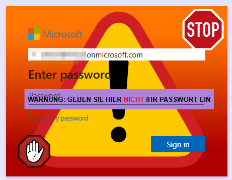

# Entra Phishing Detection

A lightweight Go-based web service that provides phishing protection for Microsoft Entra ID (formerly Azure AD) logins by detecting suspicious referer headers and displaying warning images to users.

## LICENSE

[This work](https://github.com/firefart/entra-phishing-detection) © 2025 by [Christian Mehlmauer](https://github.com/firefart) is licensed under [CC BY-NC-SA 4.0](https://creativecommons.org/licenses/by-nc-sa/4.0/?ref=chooser-v1)

## Description

This project implements a simple but effective Entra ID phishing protection mechanism for your users. While not bulletproof, it can detect simple man-in-the-middle (MITM) scenarios by validating the `Referer` header against trusted Microsoft URLs.

### How It Works

The protection leverages Microsoft Entra ID's company branding feature to provide custom CSS styling and background images. The background image is served by this web service and changes dynamically based on the request parameters and origin validation.

In a legitimate login flow:
1. Users visit the official Microsoft login page at `login.microsoftonline.com` or `login.microsoft.com` when using a passkey (or some other weird looking domains)
2. The login page requests the background image from your service
3. The `Referer` header contains the legitimate Microsoft domain
4. Your service serves a normal (transparent) background image

In a phishing attack:
1. Users visit a fake login page hosted by attackers
2. The fake page still requests the background image from your service
3. The `Referer` header contains the attacker's fake domain
4. Your service detects the suspicious origin and serves a warning image

**Important Security Note:** This mechanism can be bypassed in targeted campaigns where attackers specifically craft their requests. You should implement additional monitoring using the provided access logs and metrics, such as:
- Successful logins without corresponding requests to this service
- Requests originating from suspicious IP ranges
- Unusual request patterns or frequencies

### How it looks

The following images demonstrate what users see during a detected phishing attempt. The warning image language is automatically determined using the `Accept-Language` HTTP header sent by the browser. Currently, German and English images are provided by default, with all other languages falling back to English.

You can provide custom images for additional languages using the configuration file. If you omit the image configuration entirely, the default images (compiled into the binary) will be used, eliminating the need for external resources.

**Warning displayed to English users:**


**Warning displayed to German users:**



### Multi-Client Support

This service supports multiple clients/organizations. Simply create a subdomain for each client and point them to this server. The logs and metrics will include the local server's hostname, allowing you to differentiate between clients.

## Features

- 🛡️ **Phishing Detection**: Automatically detects suspicious referer headers and displays warning images
- 🌍 **Multi-Language Support**: Serves localized warning images based on browser language preferences
- 🎨 **Custom Images**: Support for custom warning images per language
- 📊 **Prometheus Metrics**: Built-in metrics for monitoring and alerting
- 🔧 **Flexible Configuration**: JSON config file with environment variable overrides
- 🐳 **Docker Ready**: Includes Dockerfile and docker-compose setup
- 🏎️ **Kubernetes Ready**: Includes sample helm chart to deploy to k8s or OpenShift
- 📝 **Structured Logging**: JSON and text file logging with rotation support for k8s use
- 🔒 **Security Headers**: Proper security middleware and header validation
- 🏥 **Health Checks**: Built-in health check endpoint for load balancers

## Requirements

- **Go 1.25+** (for building from source)
- **Docker & Docker Compose** (for containerized deployment)
- **Microsoft Entra ID tenant** with company branding feature access
- **Reverse proxy** (Caddy, nginx, or similar) for production deployment
- **Valid SSL/TLS certificate** for your domain

## Technical Limitations

The company branding CSS feature has limitations as it's parsed by JavaScript and only allows [styling of predefined elements](https://learn.microsoft.com/en-us/entra/fundamentals/reference-company-branding-css-template). This prevents advanced CSS techniques like dynamic imports, so we work exclusively with background images.

## Quick Start Guide using cloudflared

### 1. Prerequisites

Ensure you have:
- ✅ Microsoft Entra ID tenant with admin access
- ✅ Domain name for hosting the service
- ✅ SSL/TLS certificate for your domain
- ✅ Docker and Docker Compose installed
- ✅ Cloudflared tunnel configured and pointing to your server

### 2. Initial Setup

1. **Clone and configure**:
   ```bash
   git clone https://github.com/firefart/entra-phishing-detection.git
   cd entra-phishing-detection

   # Copy configuration templates
   cp config.sample.json config.json
   cp Caddyfile.sample Caddyfile
   ```

2. **Generate random paths** (important for security):
   ```bash
   # Generate UUIDs for your paths
   echo "Image path: $(uuidgen | tr '[:upper:]' '[:lower:]')"
   echo "Health path: $(uuidgen | tr '[:upper:]' '[:lower:]')/health"
   echo "Version path: $(uuidgen | tr '[:upper:]' '[:lower:]')/version"
   ```

3. **Edit `config.json`**:
   ```json
   {
     "server": {
       "listen": ":8000",
       "listen_metrics": ":8001",
       "path_image": "your-generated-uuid-here",
       "path_health": "your-generated-uuid-here/health",
       "path_version": "your-generated-uuid-here/version",
       "secret_key_header_name": "X-Secret-Key-Header",
       "secret_key_header_value": "SECRET",
       "ip_header": "CF-Connecting-IP",
       "host_headers": [
         "X-Forwarded-Host",
         "X-Original-Host",
         "X-Real-Host"
       ],
     },
     "allowed_origins": [
       "login.microsoftonline.com",
       "login.microsoft.com",
       "autologon.microsoftazuread-sso.com",
       "device.login.microsoftonline.com"
     ],
     "treat_missing_referer_as_phishing": false
   }
   ```

4. **Create `.env` file**:
   ```bash
   cat > .env << EOF
   WEB_LISTEN=127.0.0.1:8000
   METRICS_LISTEN=127.0.0.1:8001
   HEALTHCHECK=http://localhost:8000/your-health-path-here
   SECRET_KEY_HEADER_NAME=X-Secret-Key-Header
   SECRET_KEY_HEADER_VALUE=SECRET
   EOF
   ```

4. **cloudflared configuration**

Point your cloudflared config to `127.0.0.1:8000` and be sure to disable every caching on this domain to see all requests.

5. **Start the service**:
   ```bash
   docker-compose up -d
   ```

### 3. Configure Entra ID

1. **Navigate to Entra ID** → **Company branding** → **Customize** [docs](https://learn.microsoft.com/en-us/entra/fundamentals/how-to-customize-branding)
2. **Upload custom CSS** with the following content:
   ```css
   .ext-sign-in-box {
     background-color: white;
     background-image: url("https://your-domain.com/your-image-path");
     background-size: cover;
     background-position: center;
     background-repeat: no-repeat;
   }
   ```
  **Important:** Replace `https://your-domain.com/your-image-path` with your actual domain and the image path configured in your `config.json` file.

3. **Save and publish** the branding configuration

### 4. Testing

1. **Test legitimate access**:
   ```bash
   curl -H "Referer: https://login.microsoftonline.com/" \
        https://your-domain.com/your-image-path
   ```

2. **Test phishing detection**:
   ```bash
   curl -H "Referer: https://fake-phishing-site.com/" \
        -H "Accept-Language: en" \
        https://your-domain.com/your-image-path
   ```

3. **Check metrics**:
   ```bash
   curl http://127.0.0.1:8001/metrics
   ```

## CLI Options

Use `--help` to display all available flags and their default values:

| Flag           | Description                                                               |
| -------------- | ------------------------------------------------------------------------- |
| `-config`      | Path to the configuration file (alternatively, use environment variables) |
| `-debug`       | Enable debug output for troubleshooting                                   |
| `-configcheck` | Validate the configuration file and exit with an error code if invalid    |
| `-version`     | Display version information and exit                                      |

## Configuration Reference

### JSON Configuration (`config.json`) and Environment Variables

| Configuration Key                   | Environment Variable                          | Description                                                                                                                                                                                                                |
| ----------------------------------- | --------------------------------------------- | -------------------------------------------------------------------------------------------------------------------------------------------------------------------------------------------------------------------------- |
| `server.listen`                     | `ENTRA_SERVER_LISTEN`                         | IP address and port for the main web server (e.g., `:8000` or `127.0.0.1:8000`)                                                                                                                                            |
| `server.listen_metrics`             | `ENTRA_SERVER_LISTEN__METRICS`                | IP address and port for the metrics endpoint (should not be exposed to the internet)                                                                                                                                       |
| `server.graceful_timeout`           | `ENTRA_SERVER_GRACEFUL__TIMEOUT`              | Graceful shutdown timeout when stopping the server (e.g., `5s`)                                                                                                                                                            |
| `server.secret_key_header_name`     | `ENTRA_SERVER_SECRET__KEY__HEADER__NAME`      | Header name required to access the version endpoint (security middleware)                                                                                                                                                  |
| `server.secret_key_header_value`    | `ENTRA_SERVER_SECRET__KEY__HEADER__VALUE`     | Header value corresponding to `secret_key_header_name`                                                                                                                                                                     |
| `server.ip_header`                  | `ENTRA_SERVER_IP__HEADER`                     | Custom IP header when running behind a reverse proxy (ensure it's only set by trusted proxies)                                                                                                                             |
| `server.host_headers`               | `ENTRA_SERVER_HOST__HEADERS`                  | Array of headers to check for the host value, in order of preference (e.g., `["X-Forwarded-Host", "X-Original-Host"]`). Leave empty when not using a reverse proxy                                                         |
| `server.path_image`                 | `ENTRA_SERVER_PATH__IMAGE`                    | URL path for the image endpoint (use a random UUID to prevent easy discovery by scanners). Exclude the leading slash                                                                                                       |
| `server.path_health`                | `ENTRA_SERVER_PATH__HEALTH`                   | URL path for the health check endpoint which is secured with the secret key header                                                                                                                                         |
| `server.path_version`               | `ENTRA_SERVER_PATH__VERSION`                  | URL path for the version information endpoint which is secured with the secret key header                                                                                                                                  |
| `logging.access_log`                | `ENTRA_LOGGING_ACCESS__LOG`                   | Enable internal access logging (useful when not using a reverse proxy)                                                                                                                                                     |
| `logging.json`                      | `ENTRA_LOGGING_JSON`                          | Output logs in JSON format for easier parsing and integration with log aggregators                                                                                                                                         |
| `logging.log_file`                  | `ENTRA_LOGGING_LOG__FILE`                     | Log file path for persistent logging (useful in Kubernetes with logging sidecars)                                                                                                                                          |
| `logging.rotate.enabled`            | `ENTRA_LOGGING_ROTATE_ENABLED`                | Enable automatic log rotation (only applies when `log_file` is specified)                                                                                                                                                  |
| `logging.rotate.max_size`           | `ENTRA_LOGGING_ROTATE_MAX__SIZE`              | Maximum file size in MB before rotation                                                                                                                                                                                    |
| `logging.rotate.max_backups`        | `ENTRA_LOGGING_ROTATE_MAX__BACKUPS`           | Number of rotated log files to retain                                                                                                                                                                                      |
| `logging.rotate.max_age`            | `ENTRA_LOGGING_ROTATE_MAX__AGE`               | Maximum age in days to retain rotated log files                                                                                                                                                                            |
| `logging.rotate.compress`           | `ENTRA_LOGGING_ROTATE_COMPRESS`               | Enable gzip compression of rotated log files                                                                                                                                                                               |
| `images.ok`                         | `ENTRA_IMAGES_OK_<LANG>`                      | Map of language codes to file paths for normal (non-phishing) images. Use two-letter ISO language codes (e.g., `ENTRA_IMAGES_OK_EN`, `ENTRA_IMAGES_OK_DE`). If unset, a default 1x1 transparent SVG is used                |
| `images.phishing`                   | `ENTRA_IMAGES_PHISHING_<LANG>`                | Map of language codes to file paths for phishing warning images. Similar to `images.ok` but for warning images. You can configure only one type and use defaults for the other                                             |
| `timeout`                           | `ENTRA_TIMEOUT`                               | General request timeout for HTTP operations (e.g., `5s`)                                                                                                                                                                   |
| `allowed_origins`                   | `ENTRA_ALLOWED__ORIGINS`                      | Array of hostnames considered legitimate. Defaults to `["login.microsoftonline.com", "login.microsoft.com"]`. Add custom domains if using ADFS or other identity providers                                                 |
| `treat_missing_referer_as_phishing` | `ENTRA_TREAT__MISSING__REFERER__AS__PHISHING` | Treat a missing referer header as a phishing attempt and show the image. If set to false, a missing referer will be treated as a valid login, if set to true a missing referer will show the warning image. Default: false |

### Environment Variables for Docker Compose

Create a `.env` file in your project directory with the following variables:

```bash
WEB_LISTEN=127.0.0.1:8000
METRICS_LISTEN=127.0.0.1:8001
HEALTHCHECK=http://localhost:8000/health_path
```

| Variable                  | Description                                                                                                                                                      |
| ------------------------- | ---------------------------------------------------------------------------------------------------------------------------------------------------------------- |
| `WEB_LISTEN`              | Listening address for the main web server where Caddy (or your reverse proxy) should connect. If you specify only a port, it will be available on all interfaces |
| `METRICS_LISTEN`          | Listening address for the Prometheus metrics endpoint. Configure IP ACLs or authentication to prevent public exposure                                            |
| `HEALTHCHECK`             | Full URL for Docker health checks, must match the `server.path_health` property from `config.json`                                                               |
| `SECRET_KEY_HEADER_NAME`  | Secret Key Header name used for healthchecks, must match the `server.secret_key_header_name` property from `config.json`                                         |
| `SECRET_KEY_HEADER_VALUE` | Secret Key Header value used for healthchecks, must match the `server.secret_key_header_value` property from `config.json`                                       |

### Example Configuration

Here's a complete example configuration for a production deployment:

```json
{
  "server": {
    "listen": ":8000",
    "listen_metrics": ":8001",
    "graceful_timeout": "30s",
    "secret_key_header_name": "X-Secret-Key",
    "secret_key_header_value": "your-secret-key-here",
    "ip_header": "CF-Connecting-IP",
    "host_headers": ["X-Forwarded-Host", "X-Original-Host"],
    "path_image": "a1b2c3d4-e5f6-7890-1234-567890abcdef",
    "path_health": "f1e2d3c4-b5a6-9870-5432-109876fedcba/health",
    "path_version": "9876543a-bcde-f012-3456-789abcdef012/version"
  },
  "logging": {
    "access_log": false,
    "json": true,
    "log_file": "/app/logs/app.log",
    "rotate": {
      "enabled": true,
      "max_size": 100,
      "max_age": 30,
      "max_backups": 5,
      "compress": true
    }
  },
  "images": {
    "ok": {
      "en": "/app/assets/custom_ok_en.svg",
      "de": "/app/assets/custom_ok_de.svg",
      "fr": "/app/assets/custom_ok_fr.svg"
    },
    "phishing": {
      "en": "/app/assets/custom_warning_en.svg",
      "de": "/app/assets/custom_warning_de.svg",
      "fr": "/app/assets/custom_warning_fr.svg"
    }
  },
  "timeout": "10s",
  "allowed_origins": [
    "login.microsoftonline.com",
    "login.microsoft.com",
    "autologon.microsoftazuread-sso.com",
    "device.login.microsoftonline.com",
    "adfs.company.com",
    "login.company.com"
  ],
  "treat_missing_referer_as_phishing": true
}
```

**Key points about this configuration:**

- **Random UUIDs**: Used for all endpoint paths to prevent discovery
- **Multiple languages**: Custom images for English, German, and French
- **Log rotation**: Enabled with reasonable retention policies
- **Multiple origins**: Supports both Microsoft and custom identity providers like adfs
- **Security headers**: Configured for reverse proxy deployment
- **JSON logging**: Enabled for integration with log aggregators

## Monitoring and Observability

### Metrics

The application exposes Prometheus metrics on the configured metrics port. Available metrics include:
- Request counts, response times, request and response size when access log is enabled, otherwise caddy metrics are served
- Phishing detection events
- Client origin distributions
- Error rates

### Logging

The application provides structured logging with configurable formats:
- **JSON format**: For integration with log aggregators (ELK stack, Splunk, etc.)
- **Text format**: Human-readable for development and debugging
- **Access logs**: Optional detailed request logging
- **Log rotation**: Automatic rotation with compression support

### Health Checks

A health check endpoint is available at the configured path. This endpoint:
- Validates application readiness
- Checks dependency availability
- Provides status information for load balancers

## Kubernetes and OpenShift

The `helm-chart` folder contains a sample Kubernetes config with a logging sidecar to forward all logs to a remote syslog siem.
Just modify the values and configs to fit your needs.

## Security Considerations

1. **Reverse Proxy**: Always run behind a reverse proxy (Caddy, nginx, etc.) with proper SSL/TLS termination
2. **Metrics Endpoint**: Restrict access to the metrics endpoint using IP allowlists or authentication
3. **Random Paths**: Use UUIDs for image and health check paths to prevent discovery by automated scanners
4. **Header Validation**: Ensure your reverse proxy only sets trusted headers for IP and host detection
5. **Log Monitoring**: Monitor logs for unusual patterns, failed requests, or suspicious origins
6. **Regular Updates**: Keep the application and its dependencies updated

# Contributing

Contributions are welcome! Please feel free to submit a Pull Request. For major changes, please open an issue first to discuss what you would like to change.
